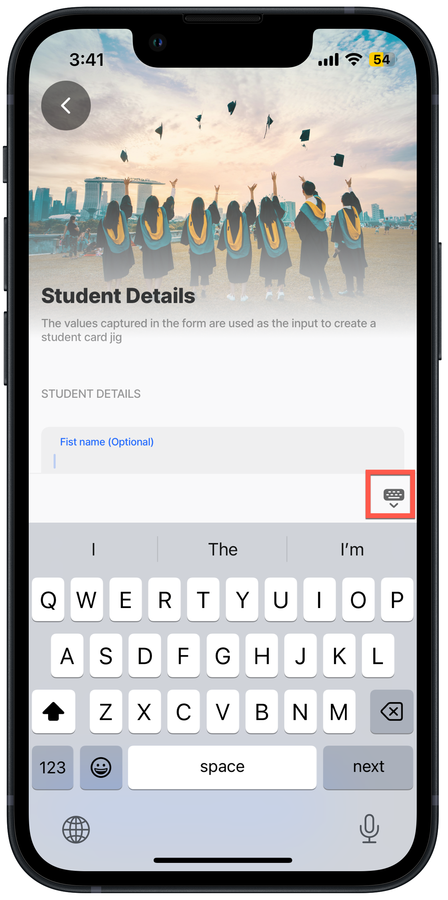
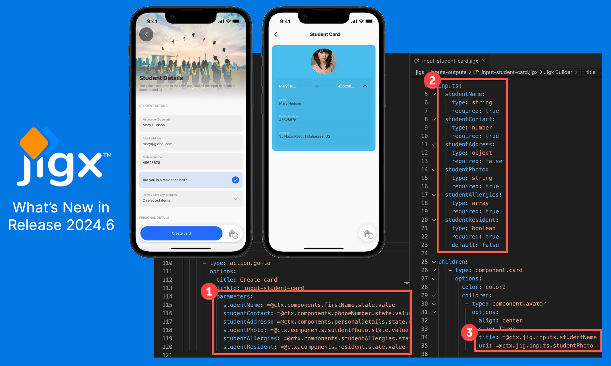
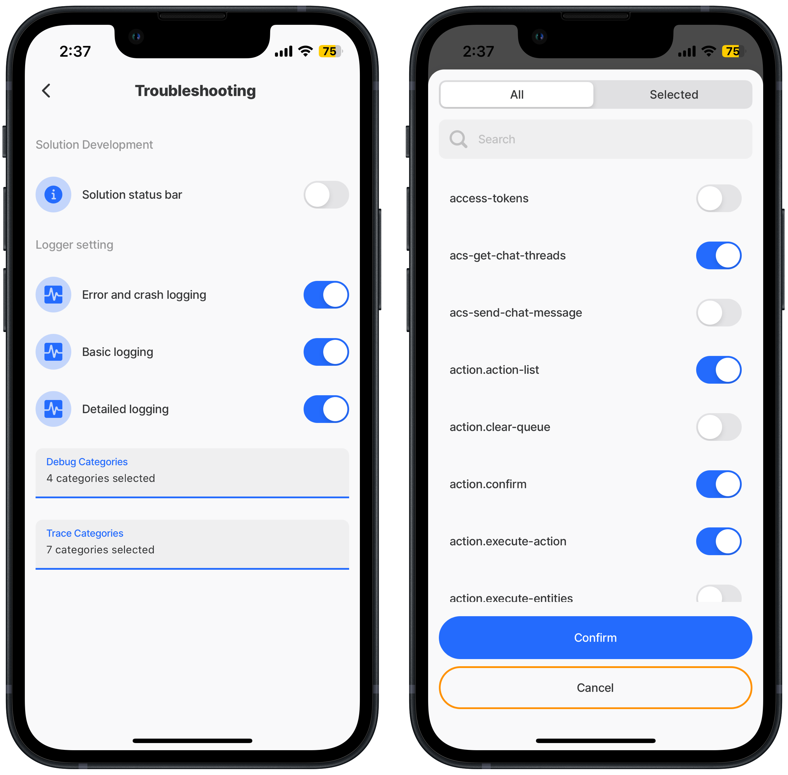
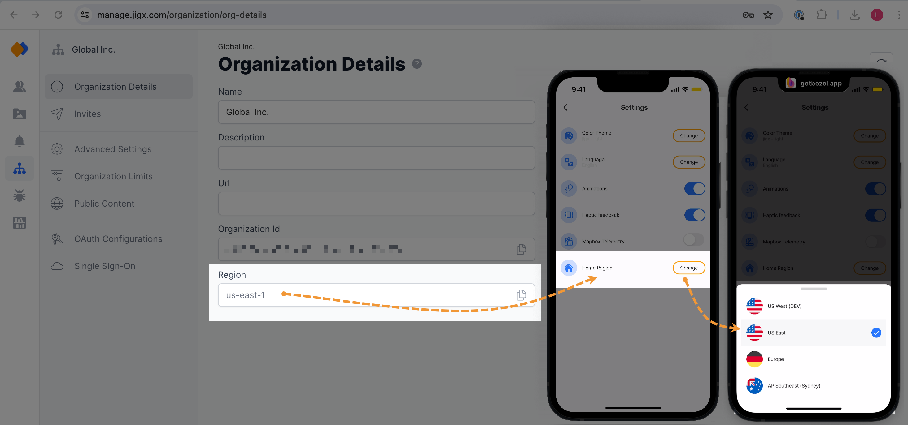
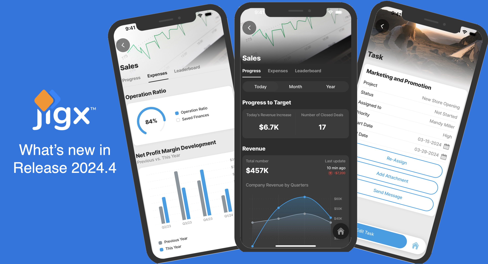
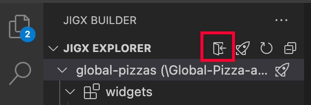
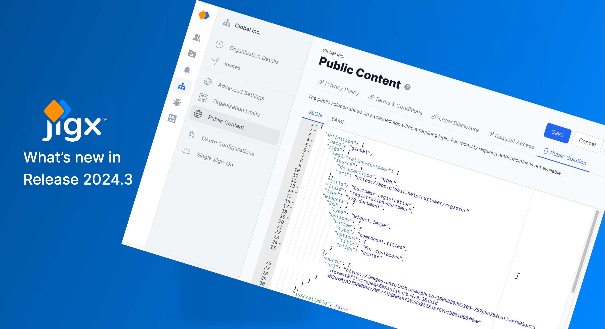
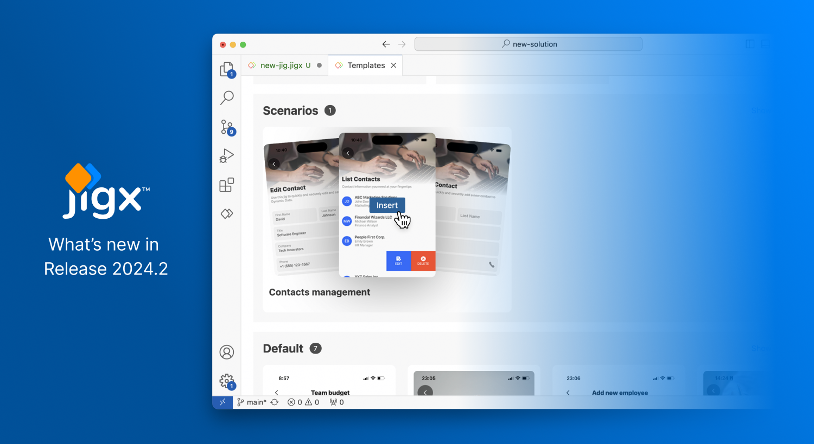
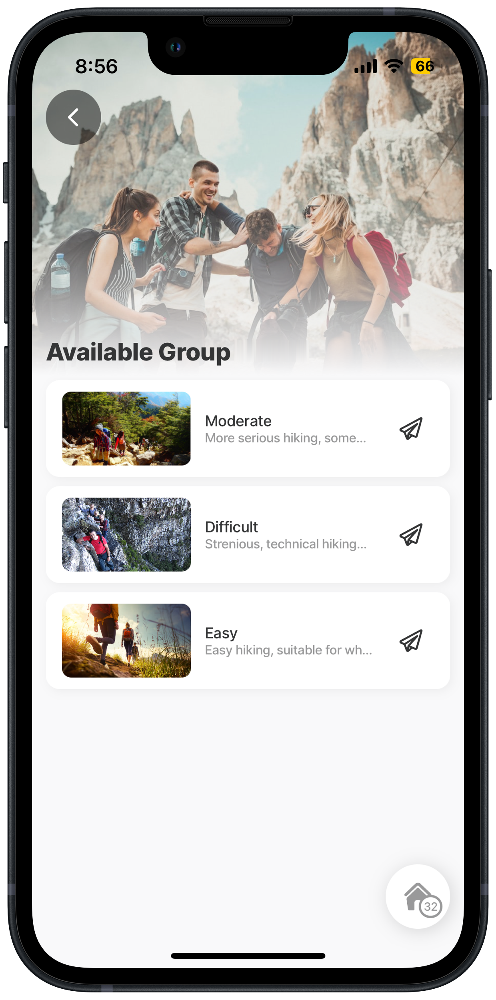

# Release Notes - 2024

### Release 2024.10

<figure><figcaption></figcaption></figure>

| Release date    | 7 November 2024 |
| --------------- | --------------- |
| iOS version     | 1.66.8          |
| Android version | 1.66.8          |
| Jigx Builder    | 1.34.0          |

#### Mobile Apps

New features & improvements

* Enhanced error message display by adding detailed information to error toasts.
* Improve performance by caching the evaluation of expression.
* Updated the wording on the 'Out of Date' screen.
* Android performance - Significant optimizations to improve performance, especially for expressions handling.

#### Components

New features & improvements

* [duration-picker](<Release Notes - 2024.md>) - The duration-picker in a form allows you to specify a time duration easily by providing a user-friendly interface where you can scroll or tap to select hours or minutes rather than manually typing in numbers. It's particularly useful for tasks that require tracking time intervals, like logging work shifts, break times, time spent on a particular task, or time-based billing. For example, an app user needs to record the time spent performing a certain activity, a duration-picker lets them choose the time.
* [Lists](<Release Notes - 2024.md>) - Enhanced list functionality for a better user experience: We've expanded the functionality of lists to enhance how you display content in both vertical and horizontal orientations.
  * [Card-wrapping](<Release Notes - 2024.md>): Wrap list items in cards for a more visually appealing presentation.
  * [Rating](<Release Notes - 2024.md>) : Add ratings to list items using values or percentages. Customize the rating icons and select their colors for better visual alignment.
  * [Tags](<Release Notes - 2024.md>): Add multiple tags to list items with the flexibility to customize tag colors. Tags appear at the bottom of each list item, providing additional context at a glance.
  * [Badges](<Release Notes - 2024.md>) : Enhanced the `rightElement: badge` property to allow badge numbers to display on the right of each list-item. Configure badges to show as dots or as numerical counts, giving you more control over how information is presented. See [jig.list](<Release Notes - 2024.md>) , and [list-item](<Release Notes - 2024.md>) component for more information.

Bug Fixes

* Fixed an issue where the `summary` component did not hide correctly when set to `false`, affecting `summary` components and summaries with actions.
* Fixed an issue where the time modal in the `date-picker` appeared compressed, rendering it nearly invisible and non-functional.

#### Builder

New features & improvements

* Conversions in [File handling](<Release Notes - 2024.md>) - You can now use expressions to create conversions when executing an entity, providing greater flexibility at runtime. Previously limited to static options, this update enables dynamic adjustments, making your app more adaptable and responsive. This improvement applies to the `conversions` property in both local and global actions, allowing you to define an array of definitions returned by an expression using: `conversions: =@ctx.datasources.conversions`

```yaml
- type: action.execute-entity
    options:
      title: Save
      provider: DATA_PROVIDER_DYNAMIC
      entity: default/category
      method: save
      data:
        id: =@ctx.jig.inputs.categoryId
        name: =@ctx.components.name.state.value
        description: =@ctx.components.description.state.value
        # reference the image using an expression 
        image: =@ctx.components.image.state.value
# The conversions for an array of definitions returned by an expression,
# rather than a static definition.          
      conversions: =@ctx.datasources.conversions 
```


```yaml
type: datasource.sqlite
options:
  provider: DATA_PROVIDER_DYNAMIC
  entities:
    - default/category
  query: |
    SELECT id, '$.name', '$.description', '$.image'
    FROM [default/category]
    ORDER BY [name]
  conversions:
    - property: image
      from: base64
      to: local-uri
```


Bug Fixes

* Resolved an error with lists nested within lists, making complex data handling more reliable.

#### Jigx Management

Bug Fixes

* General improvements.

#### Change in behavior

* The `goBack` property in `execute-entity/entities` and `submit-form` actions behavior has changed. For backward compatibility, existing `goBack` properties in these actions will still function as before. If you have any default behavior in a solution where a `goBack` has not been specified in the actions (execute-entity/entities or submit-form) it will go to the previous screen. After publishing the solution, the jig will stay on the current jig.
  * **Previous behavior**: By default, the `execute-entity/entities` and `submit-form` actions would return to the previous jig or screen (Home Hub) after execution.
  * **New behavior**: The default behavior is now to remain on the current jig (screen) after these actions are executed. If you need to go back to the previous jig, you can now configure an explicit [go-back](<Release Notes - 2024.md>) action (`action.go-back`) to achieve this behavior.

#### Known issues

* _Issue:_ When using a SELECT statement in a datasource query that does not return an `id` in the result set, and the dataset is large, it can negatively affect the solution's performance. This is especially noticeable when the data is used in a dropdown. _Workaround:_ Ensure that the query always returns a unique `id` in the dataset. The `id` must be lowercase.
* **Issue**: When using the `color` property in a number related component, such as `number-field` or `duration-picker`, and the `when` property uses an expression to determine the `color` based on a condition such as > or <, the `color` does not display as expected. **Workaround**: The `color` property will display correctly if the `when` property is set to a simple true/false condition rather than a complex expression.

#### Updates to documentation

* Added [duration-picker](<Release Notes - 2024.md>) documentation and code examples.
* Added examples of list rating, tags, wrapping, and badging to [jig.list](<Release Notes - 2024.md>) , [list](<Release Notes - 2024.md>) and [list widgets](https://docs.jigx.com/examples/readme/jig-types/jig_list).
* Updated [File handling](<Release Notes - 2024.md>) topic with using expressions in conversions.

#### Updates to Quick-Start sample solutions

<table data-header-hidden><thead><tr><th width="164.1328125">Solution</th><th>Update or addition</th></tr></thead><tbody><tr><td>jigx-samples</td><td>- Updated finance-charts.jigx datasource.<br>- Added examples for the new duration-picker.<br>- Added examples for list wrapping, rating, and tags.<br>- Updated examples using <code>execute-entity</code> and <code>execute-entities</code> to use action.go-back</td></tr></tbody></table>

### Release 2024.9

<figure><figcaption></figcaption></figure>

| Release date    | 24 October 2024 |
| --------------- | --------------- |
| iOS version     | 1.58.1          |
| Android version | 1.58.1          |
| Jigx Builder    | 1.33.0          |

#### Mobile Apps & Builder

New features & improvements

* [REST error handling](<Release Notes - 2024.md>) - Errors returned by REST endpoints are often too technical for end-users to understand. Jigx allows you to customize these error messages, enhancing user experience by making the messages clearer and ensuring users know the error is not their fault. Additionally, you can configure how to handle items in an error state, such as retrying the operation or deleting the item. For code examples see [REST errors](<Release Notes - 2024.md>).
* Additional information on error handling for datasources has been added. Global datasources, which previously failed silently, now display an error screen when issues occur. Local datasources also trigger an error screen when errors are encountered, with detailed error logs providing additional context. The following errors are detected, with details displayed on the error screen:
  * **Non-existent datasource error**: This occurs when a datasource cannot be found, often due to an outdated name, a typo in an expression, or a missing table in the default file.
  * **Query processing error**: This occurs during the execution of a datasource query, such as when an SQLite query contains syntax or logic errors.
* Added the ability to use solution settings expressions to build default values for parameter values in function files, for example: `value: =@ctx.solution.settings.custom.restStorageApiKey`

#### Deprecated

* The `errorTransform` property in REST functions has been deprecated. If you currently have `errorTransform` configured in your function, the solution will continue to function as expected to support backward compatibility. Jigx recommends you update the function file to use the new [REST error handling](<Release Notes - 2024.md>) properties that provide greater control over errors returned from the REST service.

#### Known issues

* _Issue:_ When using a SELECT statement in a datasource query that does not return an `id` in the result set, and the dataset is large, it can negatively affect the solution's performance. This is especially noticeable when the data is used in a dropdown. _Workaround:_ Ensure that the query always returns a unique `id` in the dataset. The `id` must be lowercase.

#### Updates to documentation

* Add [REST error handling](<Release Notes - 2024.md>) and [REST errors](<Release Notes - 2024.md>).

### Release 2024.8



| Release date    | 11 October 2024 |
| --------------- | --------------- |
| iOS version     | 1.55.21         |
| Android version | 1.55.21         |
| Jigx Builder    | 1.32.0          |

#### Mobile Apps

New features & improvements

* **List filters -** Set the filter to open on a specific tab in a list. The filter property's YAML snippet has changed to include the `data` (required) and `initialValue` (optional) properties. The existing filter configuration will continue to work, but the YAML snippet is squiggled in red to indicate that the new `data` property is required. The filter now handles strings and booleans, ensure the `value` for filter is configured correctly. For more information see [list](<Release Notes - 2024.md>) and [jig.list](<Release Notes - 2024.md>).


```yaml
filter:
    initialValue: "inactive"
    data:
      - title: All
        value: ""
      - title: Active
        value: active
      - title: Inactive
        value: inactive
```


* **Keyboard**: Introduced the option to hide the mobile keyboard on iOS devices on default jigs that require user input, such as forms. You can either tap the keyboard icon or click outside the keyboard to dismiss it and view the full screen.&#x20;

<figure><figcaption></figcaption></figure>

* Design your app to respond to the **device type** and **orientation**. Added two new system variables namely: - `deviceType`: The variable returns the current user's device type, such as tablet or handset, when using the expression `=@ctx.system.deviceType`. This expression is useful for determining the appropriate image size based on the device type. - `isPortrait`: The variable is set with a boolean and is used to configure the behavior of components in either portrait or landscape mode. The expression's structure is `=@ctx.system.isPortrait`.

Bug Fixes

* Improved the user login experience through improved animations for the transitions between the different screens.
* Fixed translations on `info-modal` action.
* When opening a `modal`, for example, in a `dropdown` or `media-field`, while the keyboard was open would break the view.

#### Components

New features & improvements

* [Choice-field](<Release Notes - 2024.md>) improvements include:
  * Improved the rending of the choice-field component in an expander component.
  * The `itemsPerRow` property now supports multiline (up to two-lines) text ensuring that text is not cutoff.
  * Improved the padding of the choice-field to be consistent with all other components.
  * `isMultiple` now supports expressions.

Bug Fixes

* Fixed localization for `choice` and `dropdown` components.
* Fixed layout issues for `choice` component within `card` component.
* Fixed an issue where a `web-view` component within an `expander` was crashing an Android app.

#### Builder

New features & improvements

* [Device type and orientation expressions](<Release Notes - 2024.md>): Added two new system variables namely: - `deviceType`: The variable returns the current user's device type, such as tablet or handset, when using the expression `=@ctx.system.deviceType`. This expression is useful for determining the appropriate image size based on the device type. - `isPortrait`: The variable is set with a boolean and is used to configure the behavior of components in either portrait or landscape mode. The expression's structure is `=@ctx.system.isPortrait`.
* [JavaScript Expressions](<Release Notes - 2024.md>) - You can now use JavaScript functions in expressions to streamline logic within your solutions. This feature simplifies repetitive and complex tasks, making the code more readable, understandable, and easier to debug. JavaScript functions are created in the scripts/expressions folder, and are surfaced as expressions in the YAML within Jigx Builder. New solutions open with the scripts/expressions folder structure; existing solutions will not have the folder; you can manually add the folder to these solutions. For code examples see [JavaScript expressions](<Release Notes - 2024.md>).

Bug Fixes

* Added a user-friendly warning message when list data and sections are combined stating: "Combining 'sections' and 'data' properties together is not allowed. Use either the 'data' or 'sections' property exclusively."
* Fixed an issue with inserting icons in different jigs. Previously the snippets were incorrect and resulted in you being unable to set up the icons.
* Fixed an issue where you weren't able to use shorthand to reference shared expressions.
* Jigx logs would crash when using dynamic conditional logic on a datasource with no records.
* Fixed errors in the console for incomplete data provider setups.
* Fixed link on deployment toast to navigate to output window.

#### Jigx Management

Bug Fixes

* General improvements.

#### Known issues

* _Issue:_ When using a SELECT statement in a datasource query that does not return an `id` in the result set, and the dataset is large, it can negatively affect the solution's performance. This is especially noticeable when the data is used in a dropdown. _Workaround:_ Ensure that the query always returns a unique `id` in the dataset. The `id` must be lowercase.

#### Updates to documentation

* Added [Best practice](<Release Notes - 2024.md>) topic on when to use state, inputs and outputs.
* How to [update multiple records in a single REST call](<Release Notes - 2024.md>).
* Added examples to filtering a [jig.list](<Release Notes - 2024.md>) and filtering the [list](<Release Notes - 2024.md>) component, showing how to open a specific tab using the `initialValue` property.
* Added [JavaScript functions](<Release Notes - 2024.md>) to the expressions topic and [JavaScript expressions](<Release Notes - 2024.md>) code samples.

#### Updates to Quick-Start sample solutions

<table><thead><tr><th width="161.54296875">Solution</th><th>Update or addition</th></tr></thead><tbody><tr><td>jigx-samples</td><td>- Updated list filter examples to add the data property.<br>- Added a filter example with <code>initialValue</code> configured for both list jig and using the list component in a default jig.<br>- Added examples for JavaScript functions used in expressions.</td></tr></tbody></table>

### Release 2024.7



| Release date    | 4 September 2024 |
| --------------- | ---------------- |
| iOS version     | 1.46.3           |
| Android version | 1.46.3           |

#### Mobile Apps

New features & improvements

* Upon your first or a clean install of the Jigx App on an iOS device, you will receive a notification request from the app asking for permission for Jigx to send you notifications.
* Improved the general SSO/OAuth success screen.
* Improved general startup performance of the app.

Bug Fixes

* Fixed an issue with a no solutions message displaying right after login.
* Fixed an issue with multiple permission requests at the same time.

#### Components

New features & improvements

* [chat](<Release Notes - 2024.md>) - Experience seamless communication on the go with our chat-message component, keeping you connected anytime, anywhere. Create a chatbot using [OpenAI integration](<Release Notes - 2024.md>).
* [choice-field](<Release Notes - 2024.md>) - The choice-field component allows you to select one or more options from a predefined list. This enhances user experience by providing a straightforward way to make selections, such as choosing a setting, selecting a category, or picking an item from a list.

Bug Fixes

* Fixed an issue with the elected `state` for multiple selected right checkboxes not resolving correctly in `functionParameters`.
* Fixed an issue with `component.list.state.amounts` not working correctly.
* Fixed an issue with `when` conditions not evaluating correctly in action lists under certain cirumstances.

#### Jigx Management

Bug Fixes

* General improvements.

#### Updates to documentation

* Added documentation for the [chat](<Release Notes - 2024.md>) component with a chatbot code example.
* Added documentation and code examples for the [choice-field](<Release Notes - 2024.md>) component that is used in a [form](<Release Notes - 2024.md>).
* Added a code example for autofilling forms using the [textContentTypes](<Release Notes - 2024.md>) property.

#### Updates to Quick-Start sample solutions

<table><thead><tr><th width="134.16796875">Solution</th><th>Update or addition</th></tr></thead><tbody><tr><td>jigx-samples</td><td>- Added choice-field examples</td></tr></tbody></table>

### Release 2024.6

<figure><figcaption></figcaption></figure>

| **Release date**         | 21 August 2024 |
| ------------------------ | -------------- |
| **iOS version**          | 1.43.3         |
| **Android version**      | 1.43.3         |
| **Jigx Builder version** | 1.30.0         |

#### Mobile Apps

Bug Fixes

* Improved general and loading performance of the app.
* Fixed the app screen freezing when setting the state of the `isDiscardChangesAlertEnabled` of `component.form`.
* Fixed an issue with Chinese localization.

#### Components

Improvements

* Added the ability to play full-screen videos in `component.webview` on Android.

Bug Fixes

* Fixed an issue with `component.form` and option `isDiscardChangesAlertEnabled` not behaving correctly.
* Fixed an issue with the `component.dropdown` not resetting its value after sending data to a remote data store.
* Fixed multiple issues with `component.expander's` rendering behavior.

#### Builder

New features & improvements

* Pass data easily between jigs using [inputs](<Release Notes - 2024.md>). Define the input type, such as string, boolean, or array, whether the input data is required or not, and define a default value.

#### Management

Bug Fixes

* General improvements and bug fixes.

#### Updates to documentation

* The _Developer Reference_ and Examples spaces have been merged to create the [Reference & Examples](https://docs.jigx.com/examples) section.
* The [State](<Release Notes - 2024.md>) topic has been updated.
* Add new information and examples to [Passing data using inputs](<Release Notes - 2024.md>).
* New topic on setting and using [custom variables](<Release Notes - 2024.md>).

#### Updates to Quick-Start sample solutions

<table><thead><tr><th width="161.4609375">Solution</th><th>Update or addition</th></tr></thead><tbody><tr><td>jigx-samples</td><td>- Added jigx-widgets<br>- Updated the location widgets<br>If you have a copy of the jigx-samples and jigx-widgets solutions in your organization, we recommend you get a new copy of the jigx-samples solution from <a href="https://github.com/jigx-com/jigx-samples/tree/main/quickstart/jigx-samples">GitHub</a> or <a href="https://manage.jigx.com/quickstart">Management Prod</a>.</td></tr><tr><td>jigx-widgets</td><td>Merged the jigx-widgets solution into jigx-samples solution.</td></tr></tbody></table>

### Release 2024.5



|                          | Versions & dates |
| ------------------------ | ---------------- |
| **Release date**         | 24 June 2024     |
| **iOS version**          | 1.38.2           |
| **Android version**      | 1.38.2           |
| **Jigx Builder version** | 1.29.0           |

#### Mobile Apps

New features & improvements

* [Troubleshooting](<Release Notes - 2024.md>) - The app's profile > troubleshooting section now has improved detailed logging. Toggle the categories you want to troubleshoot or see which ones are enabled using the _Selected_ tab.&#x20;

<p align="center"></p>

* Added the ability to tap on a widget to trigger an action by adding an `onPress` event to the widget properties. See the widget [onPress](<Release Notes - 2024.md>) example for more information.
* [Offline remote data handling](<Release Notes - 2024.md>) - Dealing with offline remote data is fundamental to ensuring data synchronization between the mobile app and the remote data source, allowing users to continue using the app and performing actions without interruption. Queue operations provide the functionality needed when the device regains network connectivity. `QueueOperations` manage a sequence of elements in a specific order. The commands in the queue can be manipulated to reduce the number of calls to the remote data store.
* Added a setting to display the current solution version in the profile>solutions screen.
* Improved SSO handling and general SSO improvements.
* Added handling of REST array types.

Bug Fixes

* Fixed an issue with the app freezing on the splash screen when offline.
* Fixed an issue with double encoding of URLs in `action.open-url`.
* Fixed an issue with organizational information not being returned in multi-organization environments (e.g. `@ctx.organization.id`).
* Fixed an issue with deep-linking from notifications into the app on Android.

#### Components

New features & improvements

* [Carousel](<Release Notes - 2024.md>) component - The carousel is an interactive component that lets you swipe through a set of items, making content navigation engaging and dynamic. For example, images, products, or content can be browsed by swiping left or right. In addition to swipe gestures, navigation identifiers are included in dots or a counter. The dots/counter indicate the current position within the carousel.
* [info-modal](<Release Notes - 2024.md>) action - The info modal is a pop-up window that provides additional information or context without navigating away from the current screen. It displays additional information and offers guidance or instructions.
* [media-field](<Release Notes - 2024.md>) - now includes uploading files, images, videos, or a combination. The number of images allowed to be selected in the `component.media-picker` has been increased.
* [Convert HEIC to JPEG](<Release Notes - 2024.md>) in `conversions`—Files are uploaded as HEIC files on iOS, which can cause issues, and viewing HEIC files on a non-iOS device is difficult. A new property has been added in the `ConversionDefinition: convertHeicToJpg`. Set the flag to `true`, and the files are converted from HEIC to JPG.
* [card](<Release Notes - 2024.md>) component - The card is a versatile and visually appealing UI element that encapsulates and presents information or interactive content in a structured, consistent, and user-friendly manner. Each card can include a mix of text, images, and interactive elements, creating a self-contained content unit.
* Added the ability to interact with disabled image groups in the `component.interactive-image`.

Bug Fixes

* Fixed an issue with `allDay` events in `component.event`.

#### Builder

Bug Fixes

* Improved Jigx debug windows making long values easier to read, especially for function parameter, parameter, and inputs.
* Fixed the `=@ctx.solution.settings` in the context of expressions when specified.
* Fixed the expression `=@ctx.solution.organizationId` and `=@ctx.solution.solutionId` to return the correct value.
* Fixed intelliSense to show `@ctx` in data columns.

#### Management

Bug Fixes

* General improvements and bug fixes.

#### Change in behavior

* Solutions listed in the Jigx App (not branded apps) will now be filtered according to the app's current region. Previously, all solutions were loaded regardless of the apps and/or organization's region. Now, solutions will load based on whether their organization's region matches the app's region. To ensure the Jigx App region matches your organization's region, you can go to Jigx Management to see what the _Organization Settings_ are. By default, the mobile app logs into the US East region. To change your mobile device's _Home Region,_ go to _Profile > Settings_ to match the organization's region in Jigx Management. This change prevents credential and connection lookup failures across regions.

<figure><figcaption></figcaption></figure>

#### Updates to documentation

* Unlock the power of **AI search** in documentation.
* Integrate with REST APIs, use the [REST](<Release Notes - 2024.md>) data provider, see [REST best practices](<Release Notes - 2024.md>) and explore [Create an app using REST APIs](<Release Notes - 2024.md>) code examples.
* [File handling](<Release Notes - 2024.md>) – learn how to convert files between base64, buffer, local and data-uri.
* Understand syncing remote data and loading local data.
* [Regex expressions](<Release Notes - 2024.md>) – see how to combine regular (regex) expressions in your JSONata expressions in Jigx Builder, which is powerful when used in text processing to find, replace, or validate strings of text.
* Customize your [home hub](<Release Notes - 2024.md>) – Learn how to create that amazing home screen that is interactive and sleek.
* Adding [deep links](<Release Notes - 2024.md>) in your app to create seamless navigation between the app and external sources.
* [Public Content](<Release Notes - 2024.md>) - specify what is accessible to the public on your organization's branded app before a user has onboarded or logged in.

#### Updates to Quick-Start sample solutions

<table><thead><tr><th width="163.41015625">Solution</th><th>Update or addition</th></tr></thead><tbody><tr><td>jigx-samples</td><td>- Added <a href="Release Notes - 2024.md">info-modal</a> component examples<br>- Added <a href="Release Notes - 2024.md">carousel</a> component examples<br>- Added <a href="Release Notes - 2024.md">widgets</a> <code>onPress</code> example<br>- Added <a href="Release Notes - 2024.md">card</a> component examples<br>- Added additional examples to <a href="Release Notes - 2024.md">media-field</a></td></tr><tr><td>jigx-widget</td><td>Added <a href="Release Notes - 2024.md">onPress</a> to widgets examples</td></tr></tbody></table>

### Release 2024.4

<figure><figcaption></figcaption></figure>

<table><thead><tr><th width="184.12109375">Hotfix</th><th>Versions &#x26; dates</th></tr></thead><tbody><tr><td><strong>Release date</strong></td><td>22 May 2024</td></tr><tr><td><strong>iOS version</strong></td><td>1.27.10</td></tr><tr><td><strong>Android version</strong></td><td>1.27.10</td></tr><tr><td><strong>Fix</strong></td><td>This hotfix release includes the following fix: - Using expressions in components with a <code>when</code> and <code>color</code> property did not change the component's color.</td></tr></tbody></table>

<table><thead><tr><th width="176.41796875">Hotfix</th><th>Versions &#x26; dates</th></tr></thead><tbody><tr><td><strong>Release date</strong></td><td>14 May 2024</td></tr><tr><td><strong>iOS version</strong></td><td>1.27.9</td></tr><tr><td><strong>Android version</strong></td><td>1.27.9</td></tr><tr><td><strong>Fix</strong></td><td>This hotfix release includes the following fix: - State values weren't evaluated correctly in the <code>dropdown</code> components.</td></tr></tbody></table>

<table><thead><tr><th width="170.98828125">Hotfix</th><th>Versions &#x26; dates</th></tr></thead><tbody><tr><td><strong>Release date</strong></td><td>7 May 2024</td></tr><tr><td><strong>iOS version</strong></td><td>1.27.8</td></tr><tr><td><strong>Android version</strong></td><td>1.27.8</td></tr><tr><td><strong>Fix</strong></td><td>This hotfix release includes the following fix: - State values weren't evaluated correctly in the <code>number</code> components.</td></tr></tbody></table>

<table><thead><tr><th width="172.21484375"></th><th>Versions &#x26; dates</th></tr></thead><tbody><tr><td><strong>Release date</strong></td><td>26 April 2024</td></tr><tr><td><strong>iOS version</strong></td><td>1.27.7</td></tr><tr><td><strong>Android version</strong></td><td>1.27.7</td></tr><tr><td><strong>Jigx Builder version</strong></td><td>1.28.0</td></tr></tbody></table>

#### Mobile Apps

New features & improvements

* Significantly faster speeds and enhanced performance on both iOS and Android devices.
* Added the ability to accommodate unknown domains not associated with the organization using a wildcard (\*) in the OAuth configuration. See [Set up a domain wildcard](<Release Notes - 2024.md>) for more information.
* An improvement has been made when loading the Jigx App, a spinner and loading text is displayed while the solution is being loaded.

Bug fixes

* Fixed an issue with profile avatars not saving correctly.
* Fixed multiple issues with Keyboard form lags and visibility.
* Fixed an issue with the app crashing when the active solution was removed.

#### Builder

New features & improvements

* [Code Navigation](<Release Notes - 2024.md>) - navigate through code with the Go to Definition (F12) and Go to References (+F12) functionality. Quickly go to data sources, components, jigs, and function definitions, or see where these are referenced across your solution.&#x20;
* _Authorization_ - Jigx Builder remembers your login credentials after a successful login, this means the next time you open Jigx Builder and want to publish a project, your credentials do not need to be re-entered. You can re-login at any time by using the login again icon at the top of the Jigx Explorer pane, as shown below.&#x20;

<figure><figcaption></figcaption></figure>

Bug fixes

* Intellisense presented an invalid option. The `function` and `functionParameters` Intellisense options have been removed from the SQLite datasource YAML snippet. Instead, use `sync-entities`, which allows you to configure the `function` and `functionParameter` needed to get data onto a device.

#### Components

Bug fixes

* Fixed the `component.bar-chart` that was not working correctly when no y-data was specified.
* Fixed an issue with the loading behavior of the `component.location`.
* Fixed an issue with the performance when getting blob or base64 data of `component.media-field`.
* Fixed an issue with `component.expander` and deleting of list-items when the expander was expanded.

#### Management

New features & improvements

* Dynamic Data record types - You can toggle between data types using the sparkler on the right of each data field and then save the record, for example, from string to number. See [Change a data record type](<Release Notes - 2024.md>) for more information.

Bug fixes

* General performance improvements and bug fixes.

#### Updates to Quick Start Sample solutions

<table><thead><tr><th width="131.1015625">Solution</th><th>Update or addition</th></tr></thead><tbody><tr><td>jigx-samples</td><td>- General improvements<br>- Changed the actions folder name to jigx-actions to allow global actions in the solution folder structure.<br>- Updated charts to include a <code>min</code> and <code>max</code> property determined by expressions.<br>- Added examples for the <code>jigx-header</code> component.<br>- Added additional examples to <code>product-item</code> component.<br>- Fixed minor bugs</td></tr></tbody></table>

### Release 2024.3

<figure><figcaption></figcaption></figure>

<table><thead><tr><th width="177.671875"></th><th>Versions &#x26; dates</th></tr></thead><tbody><tr><td><strong>Release date</strong></td><td>22 March 2024</td></tr><tr><td><strong>iOS version</strong></td><td>1.24.7</td></tr><tr><td><strong>Android version</strong></td><td>1.24.7</td></tr></tbody></table>

#### Mobile Apps

Bug Fixes

* Fixed an issue where an expression could not be used in the `title` property of the `component.section`.
* Fixed bar charts where the bar was visually pushed up when specifying points outside the minimum and maximum range.
* When public content in management was configured to enable the Request Access link, clicking on any of the widgets on a tablet (IOS and Android) gave a screen not found error.
* Fixed an issue with the `onPress` event of swipeable actions that were not triggered if a list was set to `initiallyCollapsed: true`.

Known Issue

* When a `jig.list` re-renders, e.g., after a list item is deleted, and the `jig.list` property `initiallyCollapsed: true` is set, the list appears blank. **Workaround:** Avoid using the `initiallyCollapsed: true` property in this scenario. Collapsing and expanding the list or navigating away from the jig and back will render the list items again.

#### Management

New features & improvements

* Improved the setting up of public content on an organizational level for branded apps. The improvements include JSON and YAML tabs that allow you to toggle between the files, ensuring that the JSON and YAML values are validated. Validation messages are shown to help you troubleshoot errors. See [Public Content](<Release Notes - 2024.md>) for more information.
* Find solutions faster - The solution search field on the list of solutions now supports the GUID and partial name/title.
* Improved error handling and validation.
* Performance improvements and security enhancements.

Bug Fixes

* General bug fixes.

### Release 2024.2

<figure><figcaption></figcaption></figure>

<table><thead><tr><th width="212.63671875"></th><th>Versions &#x26; dates</th></tr></thead><tbody><tr><td><strong>Release date</strong></td><td>20 February 2024</td></tr><tr><td><strong>iOS version</strong></td><td>1.23.2</td></tr><tr><td><strong>Android version</strong></td><td>1.23.2</td></tr><tr><td><strong>Jigx Builder version</strong></td><td>1.26.0</td></tr></tbody></table>

#### Mobile Apps

New features & improvements

* Added the ability to deep link from a jig to an external app using the [open-url](<Release Notes - 2024.md>) action, for example, opening Google Maps from an address link in a contacts list jig. For more information, see [deep links](<Release Notes - 2024.md>) and [open-url](<Release Notes - 2024.md>).

Bug Fixes

* Fixed animation on checkboxes.
* Fixed the issue on `charts` where an expression didn't populate the x-axis correctly.
* Fixed the incorrect jailbreak/rooted error received on specific mobile devices.

#### Builder

New features & improvements

* _Dynamically sync-entities_ - When building a solution, the number of entities to sync and the parameters for each are not always known; for example, when syncing the attachments, files, and documents from a source, there can be zero, one, or more. It is necessary to dynamically specify a list of the entities, functions, and function parameters to return from the input source using an expression. For more information, see [Dynamically sync multiple entities](<Release Notes - 2024.md>).
* Best practice for production apps is to use REST as the data layer to access data and not directly integrate to SQL using the SQL data provider. The SQL data provider will be squiggled in blue to indicate it is not recommended, together with a message to use REST instead.
* Use a [scenario template](<Release Notes - 2024.md>) to quickly create a \*contacts management \*solution. The solution consists of forms to create a new contact, view the contact details, edit the details, and list all your contacts. It is easy to customize the template for similar solutions.
* Added [Widget Templates](<Release Notes - 2024.md>) - Using widget templates significantly speeds up the development process. These templates provide a pre-built structure for the various [types of widgets](<Release Notes - 2024.md>) that can be customized as needed. Widget templates are only available on widgets with a `size` setting of 2x2 or greater.
* If an expression has a chain of single options, IntelliSense will add it at once.

Bug Fixes

* Fixed the incorrect validation error of the `url` property within a function's continuation configuration.
* Fixed an issue where the cursor jumps to a new line after selecting an IntelliSense option.
* Fixed an issue where IntelliSense didn't invoke an empty `children` array.

#### Management

New features & improvements

* Added the ability to clean up [favorite solutions](<Release Notes - 2024.md>) and to remove favorite entries that are no longer available. This is useful when a solution is deleted, or you can no longer see the solution in the list. Only the last 5 solutions pinned as favorites are tracked. This enhancement provides a quick indicator that a frequented solution from management is no longer available.&#x20;
* Creating a copy of a solution duplicates the structure of the credentials and connections to allow for easy configuration by only having to respecify secrets.
* Widgets and stories now indicate when non-group-assigned items are inaccessible by anyone. Once access is applied, access is granted according to the applied permissions.&#x20;
* Added a visible _Edit groups_ link to the solutions permissions tab making it easier to edit group access to the solution.

&#x20;

* Changed help icons to open in a new tab rather than in a widget.
* Added an indication of the solution count per organization on the [User > Profile - Organizations](<Release Notes - 2024.md>) section. This is useful for people belonging to multi-organizations. On the user's profile, all organizations assigned to the user are visible with an active solution count. Clicking on an organization will easily switch you to that organization where solutions are assigned; go to the Solutions tab, and manipulate access as required.
* Added an _Idle logout minutes_ option for Jigx Management. This is an optional security setting that, once applied, will display a prompt and then log the person out of Jigx Management after being idle for the configured period. Enabling the checkbox has a default of 120 minutes but is configurable to your requirements. See [Advanced Setting](<Release Notes - 2024.md>) for more information.

### Release 2024.1

<figure><figcaption></figcaption></figure>

|                          | Versions & dates |
| ------------------------ | ---------------- |
| **Release date**         | 19 January 2024  |
| **iOS version**          | 1.19.5           |
| **Android version**      | 1.19.5           |
| **Jigx Builder version** | 1.25.0           |

#### Mobile Apps

New features & improvements

* Added the ability to delete your account from the personal information section under your Profile screen in the mobile app. Once deleted, you are logged out of the Jigx App, and your account is deleted from Jigx Management.&#x20;

<figure><figcaption><p>Delete Jigx account</p></figcaption></figure>


* Added a new jig type for components such as [location](<Release Notes - 2024.md>) to occupy the entire screen with no other elements. See [jig.fullscreen](<Release Notes - 2024.md>) for more details.&#x20;

<figure><figcaption><p>Full screen jig</p></figcaption></figure>

Bug Fixes

* Fixed an issue with going offline and online indicators.
* Fixed an issue with `action.execute-entity/entities` and updating local tables with returned data.

#### Components

New features & improvements

* Added the `sContained` property to enhance the styling of `jig.list` and `component.list-item` which wraps each item in the list in a card. See [Lists with items contained in a card](<Release Notes - 2024.md>). This property can only be used with vertical lists and `component.list-item`.&#x20;

<figure><figcaption><p>Wrap list</p></figcaption></figure>

* Charts now support using expressions in the `max`, `min` and `tickAmount` properties.

#### Builder

Bug Fixes

* Fixed a issue where icons led to errors during the deployment of a solution.
* Fixed a issue with IntelliSense, that would not consistently show up when beginning to type a property name.
* Resolved a issue where IntelliSense options were not appearing for `jig.state`.

#### Management

New features & improvements

* Added a dropdown to Solution Settings allowing you to choose which data to copy. You can decide whether restricted data can be copied when a solution is copied.&#x20;

<figure><figcaption><p>Restrict data copying</p></figcaption></figure>

* Removed the Disable user button from the User screen in Management, use permissions to deny users access.
* Performance improvements and security enhancements.

Bug Fixes

* General bug fixes.

#### Deprecated

* The property `isScrollable` used in the `jig.default` allowing the component in the jig to fill the entire screen, has been depreciated. The new jig type [full-screen](<Release Notes - 2024.md>) provides similar functionality.

#### Updates to Quick Start Sample solutions

<table><thead><tr><th width="187.69140625">Solution</th><th>Update or addition</th></tr></thead><tbody><tr><td>jigx-samples</td><td>- <em>location-fullscreen.jigx</em> and <em>location-fullscreen-dynamic.jigx</em> updated to use the new <code>jig.fullscreen</code> instead of <code>jig.default</code> with <code>isScrollable: false</code> property that has been depreciated.<br>- Added <em>list-item-contained.jigx</em> showing vertical list-items wrapped in a card by using the <code>isContained</code> property.<br>- Fixed minor bugs</td></tr></tbody></table>
