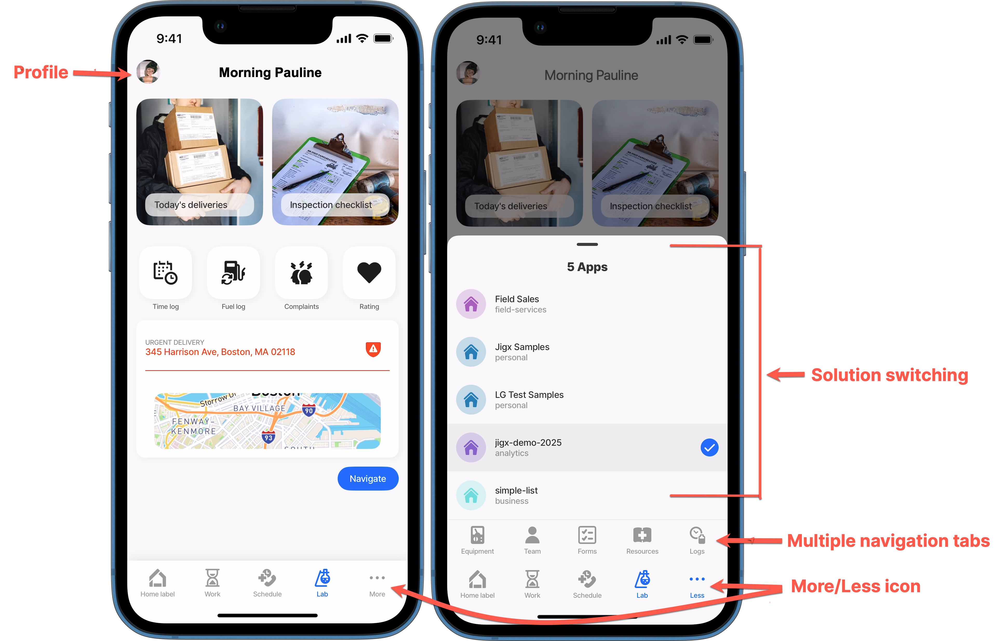

---
layout:
  width: wide
  title:
    visible: true
  description:
    visible: true
  tableOfContents:
    visible: true
  outline:
    visible: true
  pagination:
    visible: true
  metadata:
    visible: true
---

# Release Notes - 2025

## Release 2025.5

<figure><figcaption></figcaption></figure>

| Release date    | 10 September 2025 |
| --------------- | ----------------- |
| iOS version     | 1.xx.0            |
| Android version | 1.xx.0            |
| Jigx Builder    | 1.39.0            |

## Mobile Apps

#### New features & improvements

*   Solution switcher - Added properties for configuring an icon, icon color, and custom category in the index.jigx file of a solution. This allows each solution in the solution switcher to display its own customized details for better visual identification and organization.\

    <figure><figcaption>
Customized solution switcher
</figcaption></figure>

#### Bug Fixes

* The keyboard is now automatically dismissed when the `go-to` action is triggered, preventing it from staying open and obscuring components such as the bottom sheet when a field is focused.
* The `isSelectable` list type now works as expected. The select button is only visible when `isSelectable` is set to `true`. The navigation bar’s right element was updated to correctly render the Select button in the header.
* Enhanced the troubleshooting and logging UI, with better handling of toggles, headers, and dropdowns, and improved enabling troubleshooting through deeplinks.
* Fixed icons, including the flag icon, which now render correctly as location markers within the location component and as header action icons.
* Improved when a solution loads in the app, clearer feedback is now provided:
  * A _No Solution_ screen is shown instead of a blank screen.
  * The _No Solution_ screen is displayed when applicable.
  * If no bottom navigation tabs are available, a proper error message is shown.
* Fixed the logging reminder flow has been corrected. Previously, selecting _Continue Logging_ did not reset the reminder timer, causing the message to appear every time the app returned to focus. Now, choosing _Continue Logging_ properly resets the timer, and the reminder will only appear again after two weeks.
* Specific error toasts now display correctly when triggered, ensuring users see the appropriate error messages.
* Corrected the padding in the _Dropdown_ component to ensure consistent spacing and alignment.
* Inconsistent image display across screens has been resolved, ensuring images render reliably and consistently.

### Components and jig types

#### New features & improvements

* [jig.gallery](https://docs.jigx.com/examples/readme/jig-types/jig_gallery) - surface and swipe through a collection of images. This gallery fetches data dynamically from a datasource and presents each image as a gallery item, tapping an image opens it in fullscreen, where you can access the share and delete action icons at the bottom of the image. The fullscreen view also supports pinch-and-zoom to explore image details.&#x20;
* [View (custom components)](<Release Notes - 2025.md#https-docs.jigx.com-examples-readme-custom-components-_alpha_-view-_alpha_release-2025.5>) - Enhanced the view component with additional color options and support for shadows using the `hasShadow` property.&#x20;
* Added the [isSearchable](https://docs.jigx.com/examples/readme/components/common-component-properties#issearchable) and [filter](https://docs.jigx.com/examples/readme/components/common-component-properties#filter) properties to the default and grid jig type, allowing screens to be easily searched and filtered for faster navigation and improved usability.&#x20;
* A single `component.form` now automatically includes all nested field components, or custom components—eliminating the need for multiple forms on one screen.
* List-item enhancements:&#x20;
  * `text` - Added a new `element: text` option to the `rightElement`, allowing configuration of up to three defined lines of text.&#x20;
  * Introduced Line Options (`text`) for the `title`, `subtitle`, and `description` fields, allowing configuration of individual parts of the central element in a list-item. You can now set properties such as color, font size, bold, format, opacity, and the number of lines (`numberOfLines`) for each line separately, rather than applying them globally via the root. This change is fully backward compatible.&#x20;
  * `avatar` - Added a new `element: avatar` option to the `leftElement`, allowing configuration of avatar `text` and `uri` properties to display on the left of the list-item.&#x20;
  * `image` - Added a new `element: image` option to the `leftElement`, allowing configuration of the `text` and `uri` properties to display on an image on the left of the list-item.&#x20;
  * `icon` - Enhanced the `element: icon` to support multiple shapes (basic, circle, rounded), and style `type` (basic, contained, duotone).&#x20;
  * Visual improvements made to the list-item include:&#x20;
  * Added a 1px padding/margin when the list-item is `contained` and either `isHighlighted` or a percentage `value` is present, improving visibility.&#x20;
  * Introduced spacing between the label and central content.&#x20;
  * Added a minimal gap between lines in the central element to improve readability.&#x20;
  * Increased the font size of the rating for better visibility.
  * Added the `hasDynamicHeight` property for vertical lists. When used with the `numberOfLines` property, list item heights are calculated dynamically based on content. If not combined, items display as a single line. Note: Using `hasDynamicHeight` with many items may cause performance issues.

#### Bug fixes:

* _Custom components_ no longer send through an empty state when used within a form. The form now correctly receives and returns the states of its child components.
* In the _Choice_ component, configuring the `itemsPerRow` property with an expression no longer forces every item onto a new line. The component now correctly respects values such as 2 or 3 items per row.
* The _Summary_ component now displays long text descriptions correctly, ensuring proper layout and readability.
* In a jig table, actions within the select toolbar now correctly hide when the `isHidden` property is set to `true`, or the `when` property is configured.

### Builder

#### New features & improvements

* Enhancements to [REST functions](https://docs.jigx.com/building-apps-with-jigx/data/data-providers/rest/functions) now include powerful new capabilities for greater flexibility and control:
  * [Queries](https://docs.jigx.com/building-apps-with-jigx/data/data-providers/rest/functions/queries) – Define Just-In-Time (JIT) queries that run when the function executes, retrieving the latest local data from SQLite.
  * [Operations](https://docs.jigx.com/building-apps-with-jigx/data/data-providers/rest/functions/operations) – Automatically process REST responses and store results across one or more SQLite tables, with support for both success and error scenarios.
  * [Guard functions](https://docs.jigx.com/building-apps-with-jigx/data/data-providers/rest/functions/guard) – Control whether the main REST call should execute based on runtime conditions (e.g., query results, server responses, or business rules). Guards run after queries and before the main REST call, ensuring app flows only proceed when conditions are met.
* The use of `functionParameters` to store and manipulate data has been enhanced. Previously, when using `functionParameters` with `execute-entity/ies`, the parameters were combined with data and saved into local tables, which limited control over local data. Now, `functionParameters` has been split into two parts, offering greater flexibility and allowing independent interaction with local and remote databases. Backward compatibility is maintained for existing solutions that use `functionParameters`. In the YAML, `functionParameters` will appear with a yellow squiggle to indicate that it has been deprecated.&#x20;
  * `parameters`: Interacts with the remote database&#x20;
  * `data`: Interacts with the local database

#### Bug Fixes

* Resolved multiple icon cache errors in Jigx Builder when using _Solution Diagnostics_:
  * The parser no longer fails with unnecessary errors.
  * Rendering the same icon multiple times no longer produces errors.
* Resolved an issue where `queryParameters` containing substrings of other parameters were replaced incorrectly. Parameters now update reliably without unintended replacements.

### Jigx Management 

Bug Fixes

* Bug fixes, performance improvements and usability improvements.

### Deprecated changes

Data providers- The `functionParameters` property has been split into two separate properties: parameters and data. The original `functionParameters` will continue to work to support backward compatibility; the YAML will display a yellow squiggle with a message stating "Deprecated. Use the parameters and data properties instead".&#x20;

The properties `isDuotone: true` and `iscontained` have been replaced with `type: duotone` and  `type: contained`.  While these will still function, it will be flagged in the YAML with a red squiggle to indicate it’s deprecated.

### Updates to Quick-Start sample solutions

<table><thead><tr><th width="176.40234375">Solution</th><th>Additions</th></tr></thead><tbody><tr><td>jigx-sample</td><td><a href="Release Notes - 2025.md#https-docs.jigx.com-examples-readme-custom-components-_alpha_-view-_alpha_release-2025.5">jig.gallery</a></td></tr><tr><td></td><td><a href="Release Notes - 2025.md#https-docs.jigx.com-examples-readme-custom-components-_alpha_-view-_alpha_release-2025.5">count-up</a></td></tr><tr><td></td><td><a href="Release Notes - 2025.md#https-docs.jigx.com-examples-readme-custom-components-_alpha_-view-_alpha_release-2025.5">location - radius</a></td></tr><tr><td></td><td><a href="Release Notes - 2025.md#https-docs.jigx.com-examples-readme-custom-components-_alpha_-view-_alpha_release-2025.5">open-media-picker</a></td></tr><tr><td></td><td><a href="Release Notes - 2025.md#https-docs.jigx.com-examples-readme-custom-components-_alpha_-view-_alpha_release-2025.5">open-map</a></td></tr><tr><td></td><td><a href="Release Notes - 2025.md#https-docs.jigx.com-examples-readme-custom-components-_alpha_-view-_alpha_release-2025.5">generate-pdf</a></td></tr><tr><td></td><td><a href="Release Notes - 2025.md#https-docs.jigx.com-examples-readme-custom-components-_alpha_-view-_alpha_release-2025.5">share</a></td></tr></tbody></table>

## Release 2025.4

<figure><figcaption></figcaption></figure>

| Release date    | 4 July 2025 |
| --------------- | ----------- |
| iOS version     | 1.146.2     |
| Android version | 1.146.2     |
| Jigx Builder    | 1.38.0      |

### Mobile Apps

New features & improvements

* The `onRefresh` spinner is now persistently visible while an action is executing, preventing users from triggering a redundant pull-to-refresh gesture.
* Enjoy more control over your jigs, by default, the Home button appears on all jigs except the Home Hub, but now you have the flexibility to show or hide it on any jig by simply setting the `isHomeButtonVisible` property on a jig. See [Home button visibility](https://docs.jigx.com/examples/readme/jig-types/common-jig-type-properties#home-button-visibility) for more information.
* Enhanced app stability and performance by fetching only necessary image and icon assets and loading them when needed, ensuring a faster and smoother user experience.
* The profile menu has moved to the top left of the header and now appears on all Home Hub screens.
* The solution switch is now available in the bottom navigation menu. Tap the "More" (ellipsis) button to open it. Solutions are listed, with the total count displayed at the top.
* The number of permitted `tabs` in the index.jigx file has been increased. The first four `tabs` are displayed in the Home Hub bottom navigation, and any additional `tabs` appear when the "More" (ellipsis) button is tapped.

<figure><figcaption></figcaption></figure>

Bug Fixes

* Resolved an issue preventing PDF document previews from displaying correctly in the media-picker component.
* Fixed an issue where translations in header actions were not functioning correctly.
* Enhanced dynamic data syncing between Jigx Management and the mobile app, providing faster updates and significantly reducing delays.
* Fixed an issue on Android where scrolling lists within tabs caused layout problems and resulted in the search bar disappearing.
* Fixed multiple issues with notifications
  * Fixed an issue where viewing a notification with a target jig from the Notifications screen resulted in a "Screen not found" message due to the jig not being properly located.
  * Fixed notification ordering, when pressing on a message it would be sorted to the top of the screen.
  * Resolved an issue where the Notifications screen appeared empty, even when notifications were available.
* Fixed an issue where the sync scope was not correctly limited to the specific solution, ensuring accurate data synchronization.
* Resolved an issue where users could become stuck in an offline state due to a failed network request.
* Resolved an issue where switching from portrait to landscape mode on a tablet caused unintended navigation back, instead of simply adjusting the view. The app now maintains the correct screen during orientation changes.
* Fixed an issue where opening a modal jig from a list item and retrieving its outputs did not work as expected. Outputs are now correctly returned and handled.

### Components and jig types

New features & improvements

* [jig.table](https://docs.jigx.com/examples/readme/jig-types/jig_table) - The table jig displays structured data in rows and columns, allowing users to view and interact with multiple records within the app.
* [media-field](https://docs.jigx.com/examples/readme/components/media-field#restrict-or-filter-the-upload-of-media-file-types) -The media-field picker allows users to view and upload media files, with configurable filters to restrict document file types (e.g., PDF, DOC, PPT, or plainText) based on your app’s requirements.
* [bottomSheet (Beta)](https://docs.jigx.com/examples/readme/jig-types/common-jig-type-properties/bottomsheet-_beta_) - The bottomSheet slides up from the bottom of the screen to display contextual content or actions without leaving the current screen. Ideal for menus, filters, forms, or quick actions.
* _**Enhanced field component flexibility**_: Components previously only available within the form component can now be used either as standalone components or wrapped within a form component.
* [Dynamic files](https://docs.jigx.com/building-apps-with-jigx/data/data-providers/dynamic-files) extend Jigx's Dynamic Data entities to include file references, allowing files to be securely stored and associated with entities. Files are physically stored in Amazon S3, offering a combination of simplicity, security, and portability.
* **Widget customization enhancements** in [jig.grid](https://docs.jigx.com/examples/readme/jig-types/jig_grid) and [grid-item](https://docs.jigx.com/examples/readme/components/grid/grid-item) - You can now override the default widget title and icon using the `title` and `icon` properties. Additionally, widgets can be configured with an `onPress` event, enabling interactive behavior such as opening maps, displaying modals, or triggering actions.

Bug fixes

* Fixed an issue in the `component.location` where the second line of the address was not displaying.
* Fixed an issue where `filters` were not being highlighted in lists on Android devices.

### Actions

New features & improvements

* Improvements have been made to the [generate-file](https://docs.jigx.com/examples/readme/actions/generate-file) functionality, specifically related to encoding reliability and consistency.
* [open-app-settings](https://docs.jigx.com/examples/readme/actions/open-app-settings) - The action directs users straight to the app’s settings page, helping them quickly find and adjust permissions without needing to navigate through their device settings manually.

### Builder

New features & improvements

* Added [F12 code navigation](https://docs.jigx.com/building-apps-with-jigx/jigx-builder-code-editor/editor#definition-f12) functionality that allows quick navigation from within a datasource to the databases/default.jigx file for faster access and improved developer efficiency.
* [Jigx Solution Diagnostics](https://docs.jigx.com/building-apps-with-jigx/jigx-builder-code-editor/editor#validation-solution-diagnostics) - is a built-in analysis tool that helps you identify and troubleshoot issues across your entire Jigx solution or a subset of files in the solution. It detects project build errors, missing references, and scans your source code for programmatic errors, warnings, and overall solution health.
* [Custom variables](https://docs.jigx.com/administration/solutions/solution-settings/custom-variables#reloading-variables-in-jigx-builder) - IntelliSense now displays the variables configured in Jigx Management > Solution Settings when using the `=@ctx.solution.settings.custom.{{variableName}}` expression. After adding a new custom variable in Management, you can use IntelliSense's _Reload Solution Settings_ option to update data from Jigx Management and make the variable visible in IntelliSense.

<figure><figcaption></figcaption></figure>

* **Templates** - Added templates in builder for the following jigs and components.
  * [jig.grid](https://docs.jigx.com/examples/readme/jig-types/jig_grid)
  * [jig.tabs](https://docs.jigx.com/examples/readme/jig-types/jig_tabs)
  * [jig.table](https://docs.jigx.com/examples/readme/jig-types/jig_table)
  * [expander with variant](https://docs.jigx.com/examples/readme/components/expander#expander-with-variant-divider-and-expandicon)
  * [segmented-control](https://docs.jigx.com/examples/readme/components/segmented-control)
  * [grid-item](https://examples/readme/components/grid/grid-item)

Bug fixes

* Fixed issues with JSONata expression validation to ensure more accurate and reliable evaluations.
* Aligned the available options between Quick Fix and IntelliSense in Jigx Builder to ensure a consistent and streamlined developer experience.
* Fixed the YAML in the location and scenario templates.
* The `=@ctx.actions[instanceId].outputs` functionality has been updated to allow configuration outside of a sequential list for generate-file, generate-pdf, and share actions.

### Jigx Management

Bug Fixes

* Removed the delay in syncing Dynamic Data between Jigx Management and the mobile app, resulting in faster and more seamless updates.
* Bug fixes, performance improvements and usability improvements.

### Known issues

* _Issue:_ `action.share`- When sharing via AirDrop, the item is shared twice instead of once.
* _Issue_: The keyboard expands over input text fields in the `bottomSheet`.

### Updates to Quick-Start sample solutions

<table><thead><tr><th width="167.05859375">Solution</th><th>Additions</th></tr></thead><tbody><tr><td>jigx-sample</td><td><a href="https://docs.jigx.com/examples/readme/jig-types/jig_grid">jig.grid</a></td></tr><tr><td></td><td><a href="https://docs.jigx.com/examples/readme/jig-types/jig_tabs">jig.tabs</a></td></tr><tr><td></td><td><a href="https://docs.jigx.com/examples/readme/jig-types/jig_table">jig.table</a></td></tr><tr><td></td><td><a href="https://docs.jigx.com/examples/readme/jig-types/common-jig-type-properties/bottomsheet-_beta_">bottomSheet (Beta)</a></td></tr><tr><td></td><td><a href="https://docs.jigx.com/examples/readme/components/segmented-control">segmented-control</a></td></tr><tr><td></td><td><a href="https://docs.jigx.com/examples/readme/components/grid/grid-item">grid-item</a></td></tr></tbody></table>

## Release 2025.3

<figure><figcaption></figcaption></figure>

| Release date    | 21 March 2025 |
| --------------- | ------------- |
| iOS version     | 1.131.0       |
| Android version | 1.131.0       |
| Jigx Builder    | 1.37.0        |

### Mobile Apps

New features & improvements

* Added the ability to update a user's name and phone number in their profile when using the [update-profile](<Release Notes - 2025.md>) action.
* Added the ability to customize the [User Profile](<Release Notes - 2025.md>) screen. The new `component.jig` added to the index.jigx file renders any jigs in the profile screen. The customized jig has a width header and actions.
* Added support for customizing the [User Profile](<Release Notes - 2025.md>) screen.
  * A new `component.jig` entry in index.jigx renders custom jigs within the profile screen.
  * The customized jig includes a width header and actions.

Bug Fixes

* Allowed text in `titles` to wrap in the `title` container, preventing text from being cut off or blocking the `expander` from opening.
* Fixed an issue where using a deeplink to open a specific jig resulted in a blank screen.
* Resolved an alignment issue on the OTP and Request Access screens that made it difficult to access the app.
* Improved navigation from the Settings screen to the home page after switching solutions.
* Fixed the `onRefresh` event, which was not executing for a list jig on Android devices.

### Components

New features & improvements

* [count-up](<Release Notes - 2025.md>) - The count-up component is a display-only element that continuously updates in real-time, showing the elapsed time since a specified start timestamp.

### Builder

New features & improvements

* Added validation to `grid-item` determining when `widgetId` is required.
* Enhanced the way you interact with jigs by introducing the ability to retrieve `outputs` from jigs you navigated to using the following expression `=@ctx.jigs.instance-id-of-the-jig.outputs.[key-of-ouput]`.
* Added the `onTableChange` event, which responds to remote system data changes and updates the mobile device. This event monitors specific data tables (entities) for changes and triggers the configured actions when a change is detected. This ensures data consistency between the remote system and the mobile device, keeping information up to date across the platform.
* Added validation for grid-item, determining when widgetId is required.
* Enhanced interaction with jigs by enabling the retrieval of outputs from navigated jigs using the following expression: `=@ctx.jigs.instance-id-of-the-jig.outputs.[key-of-output]`.

Bug fixes

* General builder, snippets and hover popup improvements.

### Jigx Management

Bug Fixes

* Bug fixes, performance improvements and usability improvements.

## Release 2025.2

<figure><figcaption></figcaption></figure>

| Release date    | 6 March 2025 |
| --------------- | ------------ |
| iOS version     | 1.127.1      |
| Android version | 1.127.1      |
| Jigx Builder    | 1.36.0       |

### Mobile Apps

Bug Fixes

* Fixed an issue on legacy widget configurations on index.jigx.
* Fixed an error when opening an `event` in the `jig.calendar`.
* Add the no solution screen when the user doesn't have a sln assigned.
* Fixed an issue when upgrading to release 2025.01, the location component in custom components did not function.
* Fixed the UI alignment on the OTP Request access screen.

### Builder

New features & improvements

* [Jigx Variables](<Release Notes - 2025.md>)
  * When invoked within an action, the `=@ctx.system.geolocation` method executes asynchronously.
  * DEPRECATED: Set the permissions on location using the system variable `=@ctx.system.locationPermissions`. `PermissionStatus` can be `granted` | `undetermined` | `denied`
* Added Jigx Builder support for `action.sync-status`.
* Implemented `action.execute-sql` in Jigx Builder.

### Jigx Management

Bug Fixes

* Bug fixes and performance improvements.

## Release 2025.1

<figure><figcaption></figcaption></figure>

| Release date    | February 2025 |
| --------------- | ------------- |
| iOS version     | 1.125.14      |
| Android version | 1.125.14      |
| Jigx Builder    | 1.35.0        |

### Important Updates and Migration Guidance

Release 2025.1 introduces significant changes to existing functionality, components, and actions, along with new features that may impact existing solutions. While every effort has been made to provide [migration plans](<Release Notes - 2025.md>) to ensure backward compatibility, once a solution is published on this release, the changes will take effect. The primary areas impacted include the home screen (index.jigx), location component, go-to action, widgets, and stories.

* Jigx strongly recommends thoroughly testing all solutions after publishing to ensure expected behavior and stability.
* The documentation is being updated to reflect the latest product offerings. As a result, some screenshots and code samples may not yet represent the most recent features and improvements.

### Mobile Apps

New features & improvements

* [go-to](<Release Notes - 2025.md>) action - The action allows you to open a jig as a modal. Simply set the `isModal` property to `true`.
* [Navigation](<Release Notes - 2025.md>) - The [go-to](<Release Notes - 2025.md>) action is used to configure the flow of jigs in the app using the `behaviour` property. With the `behaviour` you determine if you want to push the screen into the app history, by using the `new` value, or show the one you already have in history by using the `existing` value.
* [Grid](<Release Notes - 2025.md>) and [custom tabs](<Release Notes - 2025.md>) used to create Home Hub and bottom navigation bar. For backward compatibility - see [Migration plan](<Release Notes - 2025.md>) to understand the changes that are required when republishing the solution.
* [jig.grid](<Release Notes - 2025.md>) - Create grid layouts in your app, organizing content into rows and columns for a visually consistent and flexible interface. It helps align elements proportionally, ensuring a structured design. The grid is ideal for creating galleries to display photos or product images, as well as dashboards, menus, and product lists.
* The home button has been removed from jigs and the profile button has been moved to the new bottom navigation tab bar. See [Home Hub](<Release Notes - 2025.md>) for more information.
* Added the ability to remove the Support menu from the user profile screen. This can be configured via a flag in the build configuration.
* Solution switching has been moved to the Profile settings screen.

<figure><figcaption>
Profile
</figcaption></figure>

Bug Fixes

* Improved the experience with errors appearing after logout due to long running sync actions.
* Fixed an issue for REST calls where setting your parameter to an output location would cause it to fail.
* Improvements made to error boundary and handling.
* Changed keyboard panel to match theme's background colors.
* Fixed deep translations, for example, translation of formatting of values such as $.

### Components and jig types

New features & improvements

* [jig.tabs](<Release Notes - 2025.md>) - Tabs is a new jig type that allows you to navigate between different jigs with ease, enhancing the user experience by providing an organized layout.
* [jig.grid](<Release Notes - 2025.md>) - This jig type enables you to create grid layouts in your app, organizing content into rows and columns for a visually consistent and flexible interface. The grid is ideal for creating galleries to display photos or product images.
* [Grid component](<Release Notes - 2025.md>) - create a grid layout as a component in a jig with other components.
* [Divider](<Release Notes - 2025.md>) -create a simple divider between components using the `component.divider`. The divider component adds a simple dark horizontal line across the screen. Common use cases include grouping related content or enhancing visual hierarchy.
* [segmented-control](<Release Notes - 2025.md>) - create a horizontal control consisting of segments that allows you to\*\* \*\*toggle between multiple options in a compact, efficient way.
* Actions added on [jig-header](<Release Notes - 2025.md>) - Configure actions to display as links or icons in the top right corner of the header.
* Enhanced the `media-picker’s` usability by reducing clicks/taps during the upload process.
* `List` and `list-items` improvements include:
  * Added support for using a [list-item outside a list](<Release Notes - 2025.md>) component. This allows configuring a single list item with all list-item features, such as left and right elements and swipe actions, without requiring a full list. See a code example [Single list-item in an expander](<Release Notes - 2025.md>)
  * Enhanced the `list-item` description to support multiple lines.
  * Added color support to the `value` property of the list's `rightElement`.
* Multiple enhancements made to `location` component, including support for custom markers, different markers based on a state, user's location display, and follow a user location.\*\* Note:\*\* A [Migration plan](<Release Notes - 2025.md>) is in place to ensure backward compatibility for existing solutions. However, once a solution is republished, you must update the code to ensure the location component continues to function as expected.
* Multiple improvements made to the `expander` component, including:
  * Determine the background color for header versus body using the `variant` property with `plain` or `emphasis` values.
  * Expander arrow align left or right.
  * Added the ability to add a solid or transparent `divider`.

Bug Fixes

* Fixed the shadow performance on `card` component.
* Consolidated the standard and custom card components.
* Various padding fixes across components.
* Update `entity-fields` compact border setting and content size.

### Actions

New features & improvements

* Added the `numberOfVisibleActions` property, allowing up to two buttons to be displayed in the action panel in a jig. See [Common action properties](<Release Notes - 2025.md>) for more information.
* Improved the secondary button's color and appearance.
* Enabled the action buttons to be displayed on the Home Hub.
* Actions added on [jig-header](<Release Notes - 2025.md>) - Configure actions to display as links or icons in the top right corner of the header.
* Added multiple new actions, as described in the table below:

| **New actions**                       | **Functionality**                                                                                                                                                                                                                                                                        |
| ------------------------------------- | ---------------------------------------------------------------------------------------------------------------------------------------------------------------------------------------------------------------------------------------------------------------------------------------- |
| `action.execute-sql`                  | Execute custom SQL queries on the database securely when the action button is tapped.                                                                                                                                                                                                    |
| `action.open-map`                     | Open the device's default map app (e.g., Google Maps, Apple Maps, or Waze) with the provided address when the on-screen button is tapped. See [open-map](<Release Notes - 2025.md>) for more information.                                                                                |
| `action.open-media-picker`            | Quickly manage selected media files on your device—modify or remove selections with a tap of the on-screen button. See [open-media-picker](<Release Notes - 2025.md>) for more information.                                                                                              |
| `action.generate-file`                | Generate files such as PDFs, CSVs, or text files. Content is written to the file, along with an optional encoding parameter. Once generated, the file's URI is returned and included in the action instance output. See [generate-file](<Release Notes - 2025.md>) for more information. |
| `action.generate-pdf`                 | Create a PDF file version of HTML content, whether a receipt, report, form, or other document, with just a tap. See [generate-pdf](<Release Notes - 2025.md>) for more information.                                                                                                      |
| `action.print`                        | Generate hard copies of invoices, receipts, articles, or any rendered content in raw HTML, that works across different devices and printers. See [print](<Release Notes - 2025.md>) for more information.                                                                                |
| `action.set-active-tab`               | Programmatically set the active tab in the `jig.tab` component. See [set-active-tab](<Release Notes - 2025.md>) for more information.                                                                                                                                                    |
| `action.share`                        | Share files directly from the app with just a tap. Whether it's a document, image, or report, the share action lets you send files via the devices messaging apps. See [share](<Release Notes - 2025.md>) for more information.                                                          |
| `action.set-jig-state`                | Programmatically set the state of the current jig.                                                                                                                                                                                                                                       |
| `action.reset-jig-state`              | Programmatically reset the state of the current jig.                                                                                                                                                                                                                                     |
| `action.set-solution-state`           | Programmatically set the state of the solution. Note, this action is similar to `action.set.state`.                                                                                                                                                                                      |
| `action.reset-solution-state`         | Programmatically reset the state of the solution. Note, this action is similar to `action.reset.state`.                                                                                                                                                                                  |
| `action.set-custom-component-state`   | Programmatically set the state of the [Custom Components (Alpha)](<Release Notes - 2025.md>) in the current jig.                                                                                                                                                                         |
| `action.reset-custom-component-state` | Programmatically reset the state of the [Custom Components (Alpha)](<Release Notes - 2025.md>) in the current jig.                                                                                                                                                                       |
| `action.start-sync-scope`             | The action configured to start syncing a specific subset of data with the server, effectively cutting down on network traffic and useful when the app is offline.                                                                                                                        |
| `action.delete-sync-scope`            | The action configured to delete syncing a specific subset of data with the server, effectively cutting down on network traffic and useful when the app is offline.                                                                                                                       |
| `action.delete-sync-status`           | Set the action to remove the sync status displayed on the screen (syncing, synced, failed, synced, and interrupted).                                                                                                                                                                     |
| `action.update-profile`               | Allow the user to update their profile (avatar URL) easily to keep their personal information current and ensure that the app experience is tailored to their preferences.                                                                                                               |

Bug Fixes

* Pull-to-refresh is disabled when no `onRefresh` actions are set.

### Builder

New features & improvements

* Determine the version of the app by using [system](https://docs.jigx.com/examples/readme/expressions/jigx-variables) states, the expression used is `=@ctx.system.appVersion`.
* REST improvements include:
  * Enabled the use of custom JavaScript in REST function expressions.
  * Added default 401 error handler in the REST provider to retry three times.

Bug Fixes

* Fixed `input` suggestions when no input definitions are provided.
* Fixed IntelliSense options for `leftElement`.
* Enabled field validation for `componentId`.
* Fixed an issue where the preview of expressions honored global expressions over local expressions.
* Changed Jigx Builder to show all components even if they had different properties already configured in a list and provider property.
* Fixed an issue where deploying a single JavaScript file resulted in the entire solution being deployed.
* Updated the validation message for input parameters.
* Fixed an issue where publishing failed when using the publish button next to tabs.
* Fixed an issue whereby IntelliSense did not invoke for certain jigs at a certain position.
* Fixed and improve autocomplete for `swipeable` property in the list component.
* The `isDiscardChangesAlertEnabled` in the form component default value has changed from `true` to `false`.

### Jigx Management

New features & improvements

* Dynamic data improvements include:
  * Support for files.
  * Column filters.
  * View/edit consecutive rows via the record editor.
  * Easily continue adding new rows without closing record editor.
* General UI improvements:
  * Right-sidebar collapsible (where relevant).
  * Improved keyboard accessibility on drawers and alerts.
* Troubleshooting improvements:
  * Expanded filtering, log detail and grouping of log messages.
  * Ability to export logs.
* Performance improvements:
  * Improved performance of bulk actions (like adding/removing dynamic data & solution members) and indication of progress.
* User Preferences enhancements:
  * Expose and persist management preferences like `theme` and `preferred default menu` to streamline experience across devices.
* Users
  * Ability to import users via CSV.
* General
  * Bug fixes and general improvements.

### Change in behavior

* _Backwards compatibility_ - When a widget displayed on the Home Hub and no specific icon was configured, a default icon of four squares was shown. In existing solutions the four squares are now replaced with a default heart icon. You can change the icon by configuring the `icon` property in each jig file.

### Deprecated

* The `story-group` component and `stories` property in index.jigx has been removed for all new and existing solutions. If you currently use stories on your home screen they will no longer appear in the app and in Jigx Builder the YAML will have red squiggles. Remove the YAML in Jigx Builder and republish.
* The ability to set access to widgets in a solution in Jigx Management for users and groups has been removed.
* The `home` property in index.jigx used to display a custom Home Hub has been removed. Reference the custom home jig under the new `tabs` property. See [Creating a Home Hub](<Release Notes - 2025.md>) for more details.

### Updates to documentation

* **Note:** The documentation is being updated to reflect the latest product offerings. As a result, some screenshots and code samples may not yet represent the most recent features and improvements.
